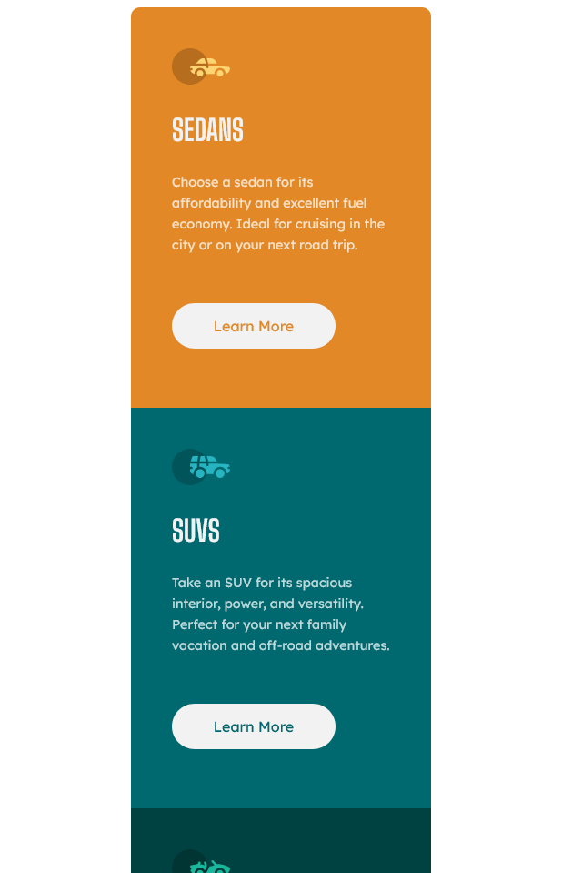
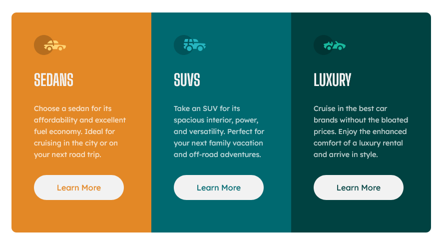

# Frontend Mentor - 3-column preview card component


## Welcome! 👋

Thanks for checking out this front-end coding challenge.

[Frontend Mentor](https://www.frontendmentor.io) challenges help you improve your coding skills by building realistic projects.

## The challenge

Users should be able to:

- View the optimal layout depending on their device's screen size
- See hover states for interactive elements

### Screenshot




### Links

- Solution URL: (https://github.com/giseleschaves/3-column-preview-card-component-main)
- Live Site URL: (https://giseleschaves.github.io/3-column-preview-card-component-main/)

## My process

- 1. check the difference between mobile and desktop to create the hmtl structure
- 2. upload fonts, identify colors and where they should be aplied
- 2. implemented flex box change between mobile and desk
- 3. implemented each card on the mobile size
- 4. checl if the transition mobile X tablet X desk is working

### Built with

- Semantic HTML5 markup
- CSS custom properties
- Flexbox
- Mobile-first workflow

### What I learned

I review 3 conceps that I got stuck during the challenge:

- flexbox, change orientation
- target elements not using classes to practice options o css selectors

Some HTML code about css selector to apply color without create a class for each card

```css
section:nth-of-type(1) {
  background-color: #e38826;
}
section:nth-of-type(2) {
  background-color: #006970;
}
section:nth-of-type(3) {
  background-color: #004241;
}
```

### Continued development

Become more comfortable with flex box properties

### Useful resources

Again thanks Kyle for this amazing tutorial about flex-box

- Kyle from Web Dev Simplified - Learn CSS Transform (https://youtu.be/rzD-cPhq02E)

## Author

- Frontend Mentor - @giseleschaves(https://www.frontendmentor.io/profile/giseleschaves)
- Twitter - @gisele_s_chaves(https://www.twitter.com/gisele_s_chaves)
